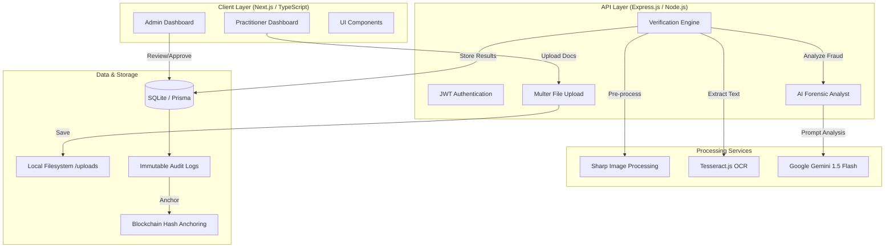

# DocAuth - System Architecture

This document provides a detailed overview of the DocAuth verification pipeline and system structure.

## 📐 High-Level Architecture

## 🔄 Verification Workflow

1.  **Ingestion**: Practitioner uploads ID, Degree, and Licenses via the **Practitioner Dashboard**.
2.  **Processing**:
    *   **Sharp**: Normalizes images, detects blur, and generates quality signals.
    *   **Tesseract.js**: Extracts raw text from documents.
3.  **Forensic Analysis**:
    *   **Google Gemini**: Analyzes the OCR text and system signals in **Strict Mode**.
    *   Detects tampering, structural inconsistencies, and missing official Algerian keywords.
4.  **Trust Scoring**:
    *   Calculates a score (0-100) based on identity matching, credential validity, and forensic results.
5.  **Audit Trail**:
    *   Every decision is logged.
    *   Hashes are (mock) anchored to a blockchain for immutable proof.

## 🛡️ Security Model

- **RBAC**: Strict separation between `DOCTOR` and `ADMIN` roles via JWT.
- **Data Integrity**: Prisma ORM ensures relational integrity; Audit logs track every change.
- **AI Sovereignty**: Specialized prompts tailored for Algerian administrative standards.

---
*Last Updated: May 2026*
