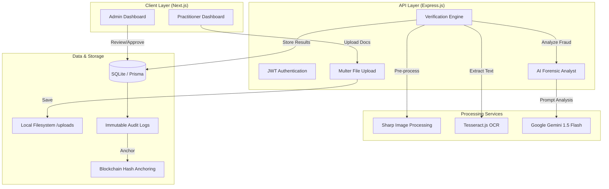

# DocAuth - Forensic Healthcare Practitioner Verification

DocAuth is an advanced AI-powered platform designed to verify healthcare practitioners in Algeria using strict forensic document analysis. It automates the verification of diplomas, IDs, and licenses while detecting potential fraud through image signals and generative AI.

## 🏗️ System Architecture



## 🚀 Key Features

- **AI Forensic Analysis**: Uses Google Gemini 1.5 Flash in "Strict Mode" to detect manipulation, inconsistent layouts, and missing official Algerian administrative keywords.
- **Image Quality Signals**:
    - **Blur Detection**: Standard deviation analysis of pixel intensity to identify low-quality or intentionally blurred documents.
    - **ELA Simulation**: Evaluates Error Level Analysis to detect potential digital tampering.
    - **Layout Consistency**: Verifies document structure against Algerian administrative standards.
- **Automated Trust Scoring**: Weighted scoring engine (0-100) based on identity matching, license validity, and forensic results.
- **Security & Audit**:
    - JWT-based Role-Based Access Control (RBAC).
    - Immutable Audit Logs for all administrative actions.
    - Blockchain Hash Anchoring (Mock) for data integrity.

## 🛠️ Tech Stack

- **Frontend**: Next.js 14 (App Router), Tailwind CSS, Lucide Icons, Axios.
- **Backend**: Node.js, Express, Multer.
- **AI/ML**: Tesseract.js (OCR), Sharp (Image Stats), Google Generative AI (Gemini SDK).
- **Database**: Prisma ORM with SQLite.
- **Dev Tools**: Nodemon, TypeScript (Frontend).

## 📥 Setup Instructions

### 1. Environment Configuration
Create a `.env` file in the root directory:
```env
DATABASE_URL="file:./dev.db"
GEMINI_API_KEY="your_google_gemini_api_key"
JWT_SECRET="your_secret_key"
```

### 2. Backend Setup
```bash
cd backend
npm install
npx prisma db push
npm start
```

### 3. Frontend Setup
```bash
cd frontend
npm install
npm run dev
```

## 🛡️ Forensic Analysis Logic (Strict Mode)

The system is configured to be "stricter than a human auditor." Documents are flagged as **HIGH RISK** if:
- Official keywords (e.g., *République Algérienne*, *Ministère*) are missing.
- The image lacks natural "scan noise" (looks too clean/digital).
- Text quality is insufficient for reliable OCR.
- Stamps or signatures are missing or ambiguous.

---
*Developed for Algerian Healthcare Digital Sovereignty.*
